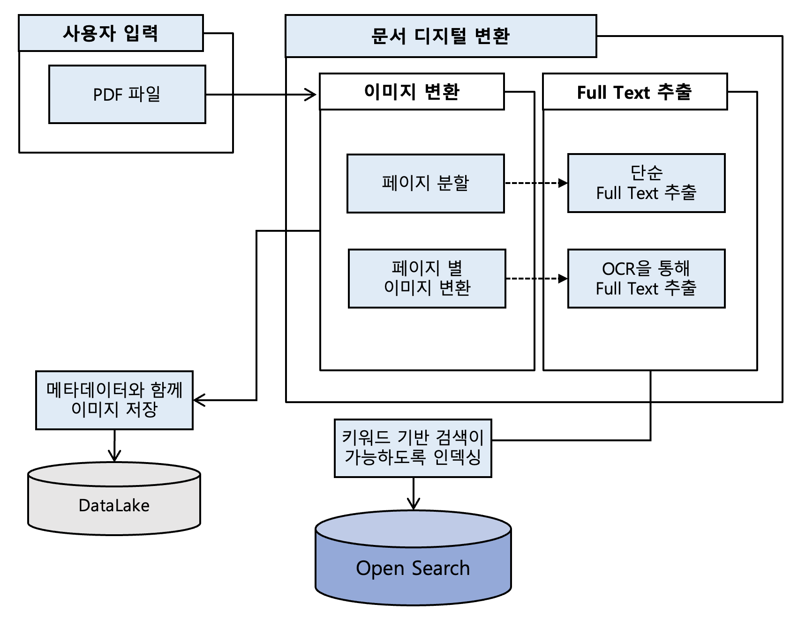
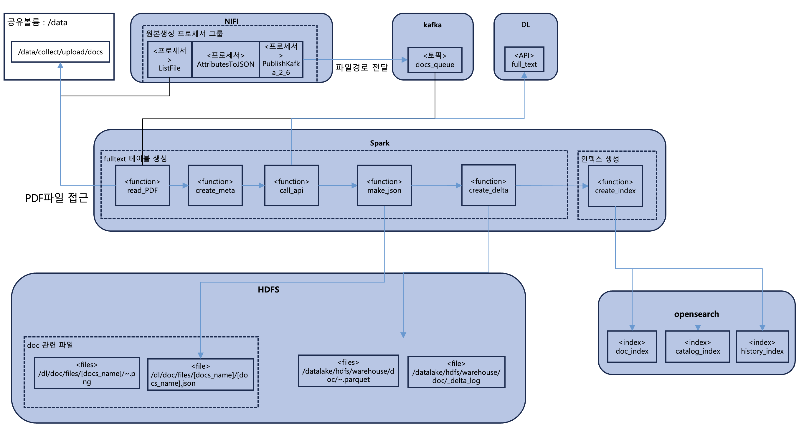
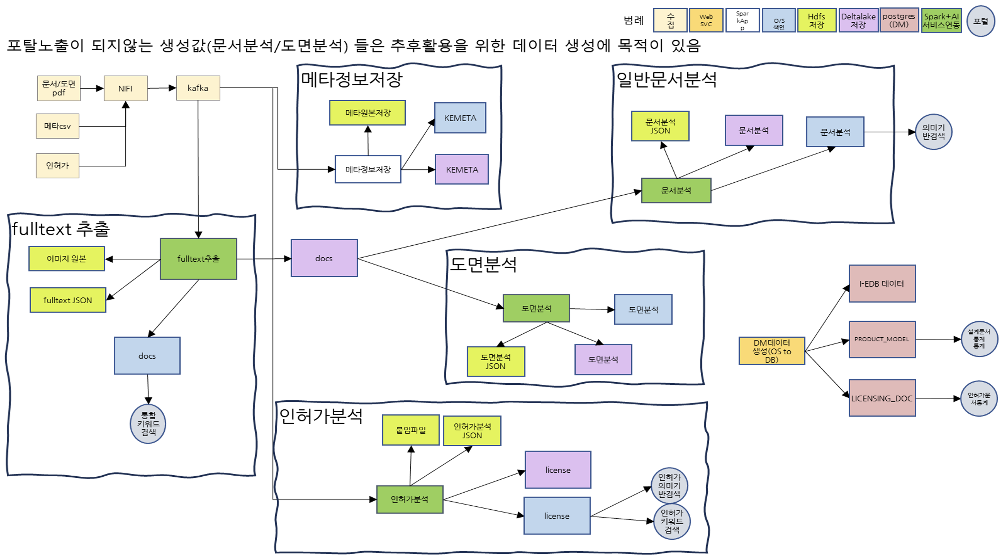
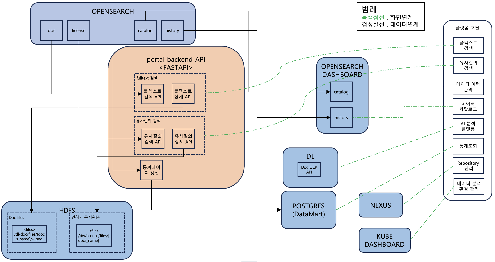

# KEPCO E&C 융복합 데이터 AI 분석을 위한 플랫폼 구축 및 요소기술 개발 - Full Text 추출

**프로젝트 전체 중 Full Text 추출에 초점을 맞춰 설명합니다.**

# 프로젝트 정보

### 1. 기간
- 프로젝트 전체 기간 : 2023.09 ~ 2024.04
- 본인 참여 기간 : 2024.01 ~ 2024.03

### 2. 인원 및 역할

| **task**         | **담당**  |
| ---------------- | ------- |
| 01. Full Text 추출 | 조영래     |
| 02. 일반 문서 분석     | 이지훈     |
| 03. 도면 분석        | 김홍준     |
| 04. 인허가 분석       | 이지훈     |
| 05. 인프라 구축       | 김영민 김다빈 |

### 3. 프로젝트 목표
- 융복합 AI분석 플랫폼 구축
- 비정형 데이터의 디지털 변환 (*)

### 4. 대상 및 범위
- 인허가 문서 18,000 여건
- 설계 도면 및 문서 약 70,000 여건

### 5. 핵심 기능
- PDF문서 내에서 Readable 페이지와 Unreadable 페이지 구분
- 방향이 회전된 페이지를 감지한 후 정상화
- Document Loader와 OCR을 이용해 PDF문서의 Full Text 추출

### 6. 전체 프로세스

**Full Text 추출**  
---

**모든 Task**  
---

**백엔드 전체 구조**
---

### 7. 기술 스택
- OCR
- PyMuPDF
- OpenCV
- HDFS
- Nexus
- pandas
- numpy
